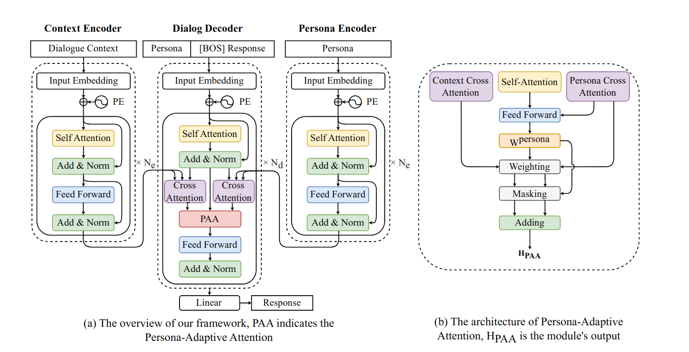
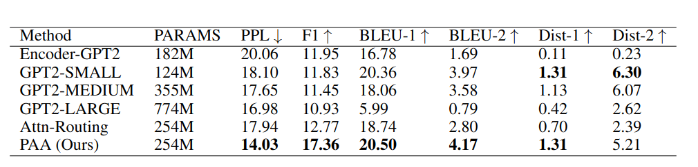
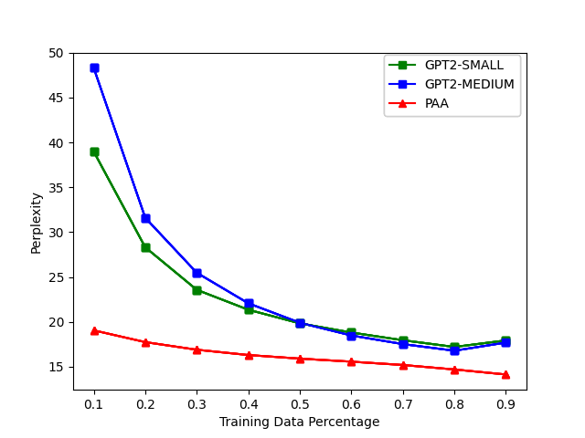
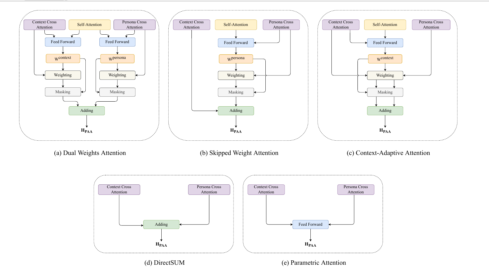

# Personalized Dialogue Generation with Persona-Adaptive Attention
This repository contains corpora, model weight, and code for training and evaluating for the paper: [Personalized Dialogue Generation with Persona-Adaptive Attention]()

## Architecture
Here is our overall architecture (PAA):


## Performance

Automatic evaluation results on ConvAI2 dataset over our implemented approach. Boldface indicates the best result
in terms of the corresponding metrics.

## Low-Resource Performance

Comparison with GPT2 under low-resource scenario, we sampled 10% to 90% of training data to train GPT2-SMALL, GPT2-MEDIUM and PAA.

# Installation & Usage
## Environment Installation
We use Anaconda to manage our environment, so we recommend to use Anaconda to install the environment.
Suppose the anaconda is installed in your system, you can create a new environment by:
```bash
conda env create -f environment.yml
```
Then you can activate the environment by:
```bash
conda activate PersonaGeneration
```

## Download Pre-trained Model weight from Huggingface
we use `gpt2` weight from [Huggingface](https://huggingface.co/gpt2/tree/main), you can download it to `downloaded_LM` directory as:

`downloaded_LM/gpt2-pytorch_model.bin`


## Unzip training file
Due to the github file size limit, we zip the training and testing text files under `data/convAI2` directory
Please unzip as:
- data
  - convAI2
    - train_self_original.txt
    - valid_self_original.txt

## Training
```bash
python train.py \
--config=config/gated_transformer/final_gated_transformer-small.yml \
--dataset=convai2 \
--lr=1e-6 \
--gated=yes \
--fusion_mode=pr-cr \
--auto_tau=accurate \
--auto_tau_numerator=persona \
--response_gated=no \
--shared_enc=no \
--shared_crossattention=no \
--add_persona_to_decoder=yes \
--add_persona_indicator=yes \
--add_role_indicator=yes
```

## Parameter
- `config`: the config yml file, we have some pre-defined yml files under config directory
- `dataset`: the dataset name, we support `convai2`
- `lr`: learning rate
- `gated`: whether to use extra cross-attention mechanism, we support `yes` and `no`
- `fusion_mode`: the way to fuse cross-attention, the deail will be demonstrated in the following section, for vanilla PAA, use `pr-cr`
- `tau`:  the `tau` value in the paper, we support manually assigned (from 0.0-1.0)
- `auto_tau`: the automatically computed `tau` (`accurate`)
- `auto_tau_numerator`: the numerator of the auto tau, we support `persona` and `context`
- `response_gated`: whether fuse response into the weighted cross-attended result from PAA, default is no, enabling will drastically reduce the performance
- `shared_enc`: whether to share the encoder between persona and context
- `shared_crossattention`: whether to share the cross-attention between persona and context
- `add_persona_to_decoder`: whether to add persona to the decoder input
- `add_persona_indicator`: whether to add persona indicator to the decoder input & encoder input
- `add_role_indicator`: whether to add role indicator to the context encoder input


## Evaluation
After model training, use the checkpoint file to do evaluation:

F1: To evaluate the F1, you can run `run_test_f1.py` with `--model_path` to your own checkpoint.

Text Decoding: To decode evaluation text file, run `run_test_decoding.py` with `--model_path` to your own checkpoint.

BLEU: To evaluate BLEU, do `validate_bleu.py` on the decoded text file.

We saved the decoded text from PAA and GPT2 models under `generated_text/` directory.
## Variant Study

In the `fusion_mode`, we support follow modes:
- pr-cr
  - The vanilla PAA design described in the paper
- cr-pr
  - The `Context-Adaptive Attention (c)` in the above figure
- random
  - The persona mask and the context mask are randomly assigned
- prr-crr
  - The `Dual Weights Attention (a)` design
- skipc-pr
  - The 'Skipped Weight Attention (b)' design described in the above figure
- param_gate
  - The `Parametric Attention (e)` design described in the above
- condition_bias
  - The Condition-bias Re-implementation.
  - Paper: ``A Simple and EfficientMulti-Task Learning Approach for Conditioned DialogueGeneration.``
- attention_routing
  - The Attention Routing Re-implementation
  - Paper: `A Pre-Training Based Personalized Dialogue Generation Model with Persona-Sparse Data`
# Citing
If you found our work or code is useful, please use the follow bibtex to cite us:
```
@article{Huang_Zhang_Ko_Liu_Wu_Wang_Tang_2023,
title={Personalized Dialogue Generation with Persona-Adaptive Attention},
volume={37},
url={https://ojs.aaai.org/index.php/AAAI/article/view/26518},
DOI={10.1609/aaai.v37i11.26518}, 
number={11},
journal={Proceedings of the AAAI Conference on Artificial Intelligence},
author={Huang, Qiushi and Zhang, Yu and Ko, Tom and Liu, Xubo and Wu, Bo and Wang, Wenwu and Tang, H},
year={2023},
month={Jun.},
pages={12916-12923}
}
```
